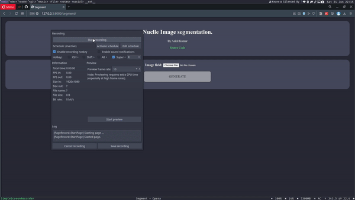
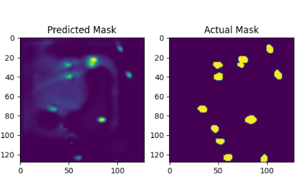

# Nuclie Image Segmentation

[Download weights](https://drive.google.com/file/d/1-PkmPa8m6jVXFJkUOmO3Df8fmEmcwwKD/view?usp=sharing) and put the tar file in `webapp/seg_classes`.



`segmentation` folder contains files related to all data presprocessing,model building and training process.

`webapp` folder contains django app deployment of model

> You can also download weights from git lfs

Dataset used [Data Scince Bowl 2018 kaggle](https://www.kaggle.com/competitions/data-science-bowl-2018)

This Dataset contains medical images of cell containing nuclie and different masks of various part of Images.

## Training Files
- `model.py`
    - This file containes custom UNET implemented from scratch using pytorch.
    - UNET is famous for segmentation of medical Imagery.
    

    - [Research paper](https://arxiv.org/abs/1505.04597)

- `dataset.py`
    - This file contains implementation of custom dataset class for training purpose.
    - We only used a little data augmentation.

- `utils.py`
    - As the name suggest this file contains all the utility function required.
        - `save_checkpoint` for saving parameters
        - `load_checkpoint` for loading parameters
        - `iou_` for calculating intersection over union score
        - `check_accuracy` for checking pixel accuracy
        - And some little functions for saving mask and images

- `train.py`
    - This file handles the training process completly
    - To retrain model:
    ```python
    # Hyperparameters
    LEARNING_RATE = 1e-3
    BATCH_SIZE = 16
    NUM_EPOCHS = 20
    NUM_WORKERS = 2
    PIN_MEMORY = True
    LOAD_MODEL = False
    DATA_PATH = "stage1_train"
    DEVICE = "cuda" if torch.cuda.is_available() else "cpu"

    ```
    > Run `train.py` after downloading datset

- This code already includes tensorboard integration to view graphs run:
    ```bash
    tensorboard --logdir runs
    ```
- This model was trained for only 20 epochs.It can be improved more using more training.These were the results after 5 epochs.
    

## Django Webapp Files

- This folder is structured according to django for deployment of Model.

- `webapp` is the core django project containing django-app named `segment` handeling ML files.

- for more info run `python manage.py help`

## Containerization and Orchestration

- This application is containerized using Docker.
- We are using `docker-compose` for orchestration of containers.
- For running webapp:
    ```bash
    docker compose -f docker-compose.yml up --build
    ```
- For stopping the aplication:
    ```bash
    docker compose -f docker/docker-compose.yml down
    ```

> Note: Make sure you have installed both docker and docker-compose

> WARNING: As this was developed in just 2 days.There can be bugs and erros.Please make sure to open a issue if you face a bug or error.


